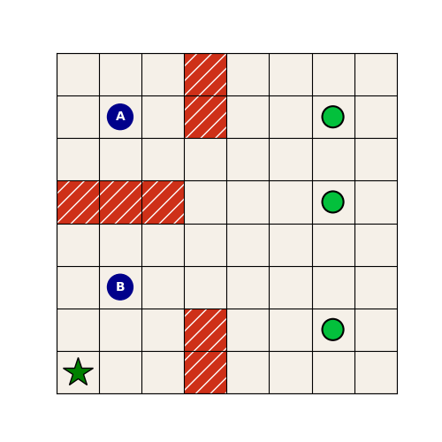
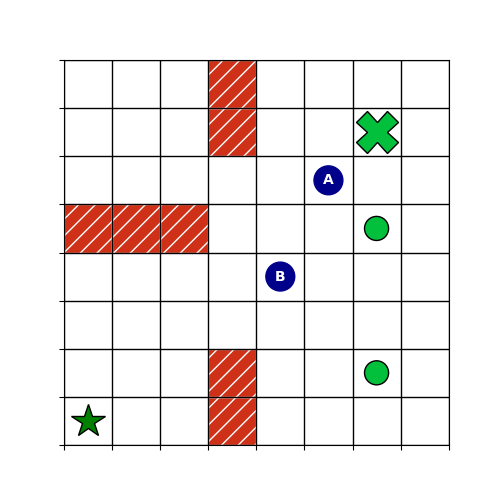
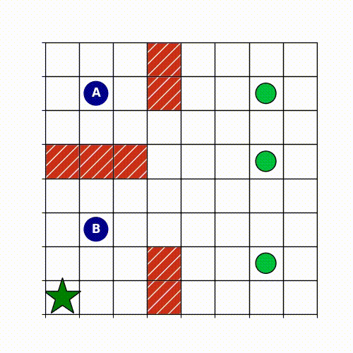

# Q-Learning in a Grid World

## Introduction

The goal of this project work is to implement the Q-learning algorithm, in the tabular sense, in a grid world consisting which simulates in a roughly way a warehouse with walls, two agents, three packages and a delivey station.

Q-learning is a reinforcement learning algorithm that trains one or more agents to assign values to its possible actions based on its current state, without requiring a model of the environment.
The first theoretical step is to write Bellman's optimality equation with respect to the optimal action value function: 
$$Q^\circ(x, u) = r(x, u) + \gamma \sum_{x'\in X} \varphi(x' | x, u) \max_{u'} Q^\circ(x', u')$$

Where:
- $X$ is the state space.
- $U$ is the action space.
- $r(x, u)$ is the instant reward at the current istant.
- $\gamma$ is the discount factor. Given the same reward we prefer an immediate one compared to a future one.
- $\varphi(x' | x, u)$ is the Markov transition density. Its a probability density function that express the probability to transition from state x to the next state x' when u action is provided.
- $Q^\circ(x, u)$ is the optimal action-value function.

Note that this formula calculates the expected value of a maximum and is therefore suitable for sample implementation.

Working with a grid the following assumptions apply:
- $X$ of finite and discrete size.
- $U$ of finite and discrete size.

Then, having sufficient memory and given those assumptions, the optimal action value function can be represented as a matrix which links every pair action-value. The matrix has rows equal to the number of states and columns equal to the number of actions.

The algorithm consists of the following steps:
1. At time t, we are in state $x(t)$, we apply the action $u(t)$ and w observe the reward $r(t)$ and the new state $x(t+1)$.

2. We update the estimated value of the pair $(x(t), u(t))$ using Temporal Difference:

    - $ \hat{Q}_{t+1}(x(t), u(t)) = r(t) + \gamma \max_{u'} Q_t(x(t+1), u')$

    - $Q_{t+1}(x(t), u(t)) = Q_t(x(t), u(t)) + \alpha(t)[\hat{Q}_{t+1}(x(t), u(t)) - Q_t(x(t), u(t))]$

where:
- $\hat{Q}_{t+1}(x(t), u(t))$ sample estimate of $Q^\circ(x, u)$
- $\gamma$ discount factor
- $\alpha(t)$ learning rate

3. All the other state-action pairs are not updated: ${Q}_{t+1}(x,u) = {Q}_{t}(x,u)$ if $(x,u) \neq (x(t), u(t))$

Being this an off policy method we want to find the optimal policy. The action value function found in the algorithm converge to the optimal one if: 
1. All the action-state pairs are visited endlessly. This is guaranteed by an $\epsilon$-greedy policy. This policy allow to choose randomly between a greedy action or a random one.
2. The learning rate decreases sufficiently slowly. This is guaranteed if we chose $\alpha = \frac{c_{1}}{c_{2} + t}$. Where t is the current iteration.

## Implementation

The experiments have been done on a 8x8 grid with the elements showed in the following image.

The grid world contains some walls, colored in red, two agents, colored in blue and labeled with A and B and three objects, colored in green, that must been delivered to the delivery station, colored in dark green and represented by a star.

The goal of the agents is to pick every object and then 'deliver' them to the station. When an object is picked it is 'removed' from the grid, an event indicated by an 'X' in place of the object.

The shaping of the reward has been done in the following way:
- When the agents crush into a wall or would have gone out of bound a reward of -0.5 is given, so that those events are avoided.
- A reward of of -0.04 is given for every empty cell so that agents are encouraged to explore.
- When an object is picked a reward of +10 is given.
- When both of them are on the delivery station and they have picked all of the objects the goal is reached and they recieve a reward of +50.

Since it has been observed during sperimentation that the main problem was getting stuck in local minimums and the Q-table was sparse, it has been decided to implement some potential-based rewards using a simple Manhattan attraction. So, all of the objects have an attractive potential that is turned of singularly when one of them in picked. After every one of them is picked a potential for the delivey station is activated. In both cases a reward of +0.05 is given for getting closer the current 'subgoal'.

Regarding epsilon, to avoid a rapid decay of its value like with the classic $\epsilon = \frac{1}{t}$, a decay rate of 0.99 was implemented instead. Stopping at 0.01.

Final adjustment has been to maintain an epsilon greedy approach even when doing the final run, with epsilon setted to constant values between 0.1 and 0.33, to escape from local minima. This has proven to be very effective.

Regarding the training, various numbers of episodes have been tested with very reliable results between 50 to 200 episodes.

# Final considerations

Changing the parameters $\gamma$, $c1$ and $c2$ didn't led to satisfactory results.

Rapid convergence, on average below 200 steps, has been obtained with almost every amount of episodes with constant $\epsilon$ varying from 0.2 to 0.33.